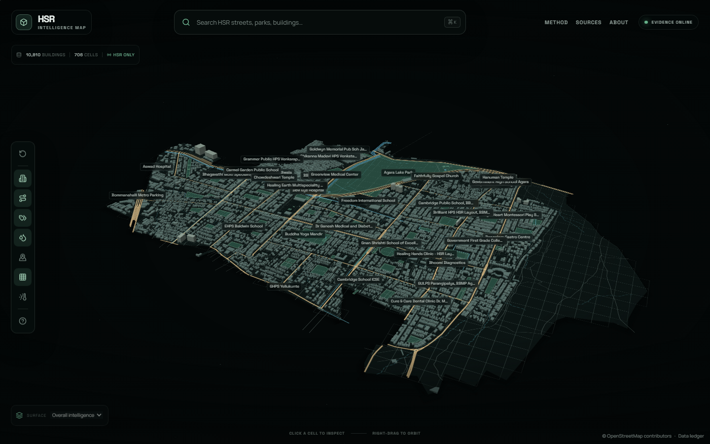

# HSR Intelligence Map

An evidence-led, interactive 3D geographic intelligence prototype for **HSR Layout, Bengaluru**.

The application renders a real, locally ingested HSR city surface—10,810 OSM building footprints, roads, parks, water, named places, BBMP/OpenCity drains and flood evidence—then divides the locality into 706 projected **100 m × 100 m** analysis cells. Selecting a cell opens environmental and infrastructure indicators with confidence, provenance, resolution, and limitations.

It never scores an individual apartment, building, street, resident, or property.



## What is implemented

- Local MapLibre 3D map: pan, zoom, pitch, rotate, orbit, reset, fly-to
- OSM relation `17168010` as the HSR locality boundary
- Real building footprints with mapped height/level data where present and disclosed category heuristics otherwise
- Roads, parks, water, drains, flood points, landmarks, POIs, and local place labels
- Projected, configurable 100 m square grid with click-to-cell lookup
- Translucent selection volume that preserves underlying geometry
- Full-grid metric surface modes and a non-binary legend
- Locally indexed, throttled search for HSR places and roads
- Responsive desktop intelligence panel and mobile bottom sheet
- Cached Open-Meteo air-quality and weather adapters with schema validation and graceful partial failure
- Imported BBMP/OpenCity stormwater-drain and flood-vulnerability KML
- Copernicus DEM GLO-90 samples for relative elevation and local-slope features
- Explainable scoring with missing-data re-normalisation
- Explicitly unavailable network quality instead of an invented score
- `/methodology`, `/data-sources`, `/about`, and `/api-docs`
- Unit, integration-style normalization, desktop E2E, and mobile E2E tests

## Architecture

```text
Offline / versioned ingestion

OSM API + Overpass        OpenCity / BBMP KML        Open-Meteo Elevation
        │                         │                           │
        └──────── download → validate → normalize ───────────┘
                                      │
                     clip to HSR relation 17168010
                                      │
                  derive 100 m grid + static cell features
                                      │
                     public/data/hsr-bootstrap.json

Runtime

Browser ── GET /api/map/bootstrap ── local normalized artifact
   │
   ├── MapLibre WebGL: real geometry + 3D extrusion + cell layers
   ├── GET /api/search?q= ───────── local OSM name index
   └── GET /api/cells/:id/metrics
                │
                ├── static drain/flood/elevation/road/amenity features
                └── bucketed + cached Open-Meteo air/weather requests
                              │
                       transparent score engine
```

Architectural decisions and tradeoffs are documented in [docs/architecture.md](docs/architecture.md).

## Technology

- Next.js App Router, React, TypeScript
- MapLibre GL JS
- TanStack Query
- Zustand
- Framer Motion
- Turf spatial predicates
- Zod upstream-response validation
- Vitest, Testing Library, Playwright

There is no database requirement for this HSR-only MVP. Static geospatial work happens during ingestion, not on Vercel request handlers or every map click.

## Local setup

Requirements:

- Node.js 20.11 or newer
- npm
- Internet access for the one-time ingestion and dynamic environmental APIs

```bash
npm install
copy .env.example .env.local
npm run data:ingest
npm run dev
```

Open `http://localhost:3000`.

The repository already contains a generated HSR artifact. Re-run ingestion when source geometry or the grid configuration changes.

## Environment variables

No secret keys are required.

| Variable | Default | Purpose |
|---|---|---|
| `NEXT_PUBLIC_APP_URL` | `http://localhost:3000` | Metadata/deployment origin |
| `MAP_DATA_MODE` | `local` | Documents the local artifact mode |
| `GRID_SIZE_METERS` | `100` | Ingestion-time square cell size |
| `OPEN_METEO_BASE_URL` | `https://api.open-meteo.com` | Weather adapter |
| `OPEN_METEO_AIR_QUALITY_BASE_URL` | `https://air-quality-api.open-meteo.com` | Air-quality adapter |
| `NOMINATIM_BASE_URL` | public endpoint | Reserved adapter configuration; public endpoint is not used at runtime |
| `OVERPASS_BASE_URL` | official endpoint | Offline OSM ingestion |

## Data ingestion

```bash
# Complete HSR data artifact
npm run data:ingest

# Aliases retained for future split pipelines
npm run data:osm
npm run data:environment
```

The current ingestion script:

1. downloads and assembles the OSM HSR locality relation;
2. fetches buildings and context from Overpass with fallback/retry;
3. clips geometry to the locality;
4. downloads OpenCity drain and flood KML;
5. samples the 90 m Copernicus DEM through the Open-Meteo Elevation API with persisted, rate-limited batches;
6. generates metre-aligned 100 m cells;
7. derives distance, density, connectivity, noise-proxy, elevation, and baseline flood features;
8. writes `public/data/hsr-bootstrap.json`.

Raw downloads are cached under `scripts/cache/` and intentionally ignored by Git.

## Development and test commands

```bash
npm run dev          # development server
npm run typecheck    # TypeScript
npx eslint .         # lint
npm test             # Vitest
npm run test:e2e     # desktop + mobile Playwright
npm run build        # optimized production bundle
npm run start        # serve the production bundle
node scripts/inspect-ui.mjs  # headless runtime/console inspection
```

## API

| Endpoint | Purpose |
|---|---|
| `GET /api/map/bootstrap` | Complete normalized HSR map payload |
| `GET /api/map/buildings` | Building footprint collection |
| `GET /api/map/roads` | Road collection |
| `GET /api/map/landmarks` | Named POIs |
| `GET /api/map/grid` | Analysis cells and static features |
| `GET /api/cells/:cellId` | Cell geometry/static evidence |
| `GET /api/cells/:cellId/metrics` | Full evidence and scored metrics |
| `GET /api/search?q=` | Local HSR OSM index |
| `GET /api/data-sources` | Source ledger |
| `GET /api/health` | Service health |

See `/api-docs` in the running application.

## Scoring summary

The configurable default weights are:

```ts
{
  airQuality: 0.25,
  floodSusceptibility: 0.30,
  drainProximity: 0.15,
  rainfall: 0.10,
  estimatedNoise: 0.10,
  connectivity: 0.10,
}
```

Unavailable metrics are omitted. Available weights are re-normalised. Evidence coverage and confidence lower the result confidence and only modestly adjust the visible rating so a weak source cannot decide an entire cell. See [docs/scoring-methodology.md](docs/scoring-methodology.md).

## Deployment

The simplest deployment is Vercel:

1. push this repository to GitHub;
2. import it into Vercel as a Next.js project;
3. set `NEXT_PUBLIC_APP_URL` to the production origin;
4. keep the generated `public/data/hsr-bootstrap.json` in the deployment;
5. deploy with the standard `npm run build`.

Do not run Overpass or KML ingestion inside a request handler. Regenerate the artifact locally or in a manually triggered/scheduled GitHub Action, review the source diff, then deploy it.

Full notes: [docs/deployment.md](docs/deployment.md).

## Known limitations

- Air quality is regional CAMS model output (approximately 45 km), not a street sensor.
- Weather is model-grid context, not a 100 m observation.
- The 90 m DEM cannot represent basement, kerb, building-pad, or drain-condition details.
- OpenStreetMap and the published KML layers may be incomplete or stale.
- Five flood-evidence points fall inside the selected HSR locality polygon; absence elsewhere is not evidence of no flood susceptibility.
- The noise indicator is a low-confidence road/activity proxy, not measured decibels.
- Network quality and property pricing are disabled because no adequate reusable HSR-cell dataset was verified.
- The 7.1 MB uncompressed bootstrap prioritises a self-contained MVP; PMTiles/vector tiles are the next performance step.
- Search is deliberately local to HSR. The public Nominatim endpoint rejected this environment and its policy forbids client autocomplete.

## Roadmap

1. Package the static geometry as PMTiles with zoom-based level of detail.
2. Add versioned source manifests and ingestion diff review.
3. Validate elevation and flood features against a higher-resolution civic dataset.
4. Add cell time series without exposing personal movement.
5. Add opt-in, privacy-preserving network measurements.
6. Add cell-to-cell comparison.
7. Expand beyond HSR only after the methodology is validated.

## Data verification

Every upstream used or rejected was exercised on **25 July 2026**. Requests, response fields, coverage, licenses, limitations, and fallbacks are recorded in [docs/data-verification.md](docs/data-verification.md).
